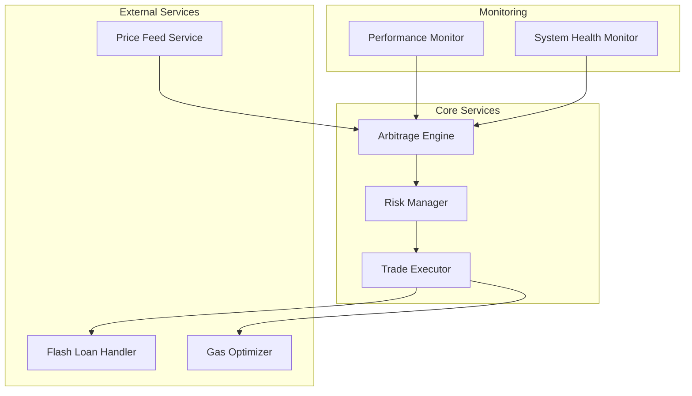
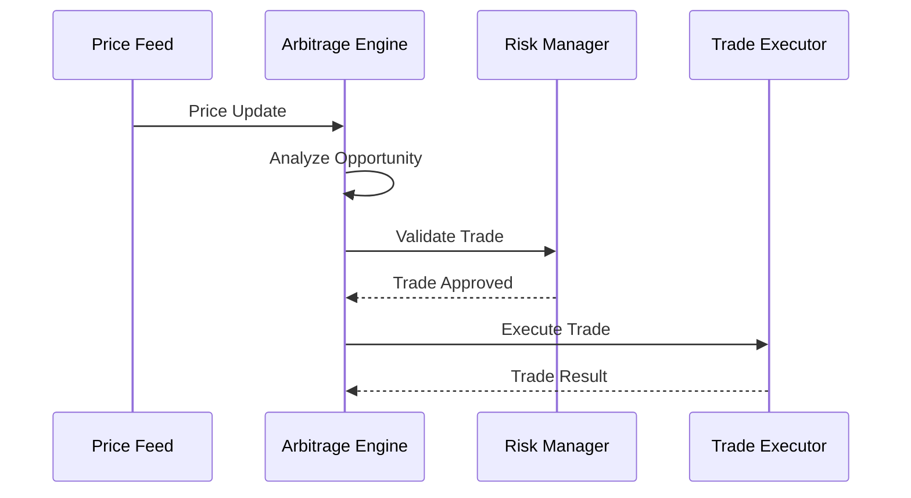

# System Architecture

## High-Level Overview

## Component Interactions

### Price Feed Service
- Connects to multiple exchanges via WebSocket
- Normalizes price data
- Implements heartbeat monitoring
- Handles connection recovery

### Arbitrage Engine
- Analyzes price disparities
- Calculates potential profits
- Manages trade execution flow
- Implements circuit breakers

### Risk Manager
- Validates trade parameters
- Enforces position limits
- Monitors portfolio exposure
- Implements stop-loss mechanisms

### Trade Executor
- Manages order execution
- Handles transaction signing
- Implements retry mechanisms
- Monitors transaction status

## Data Flow

