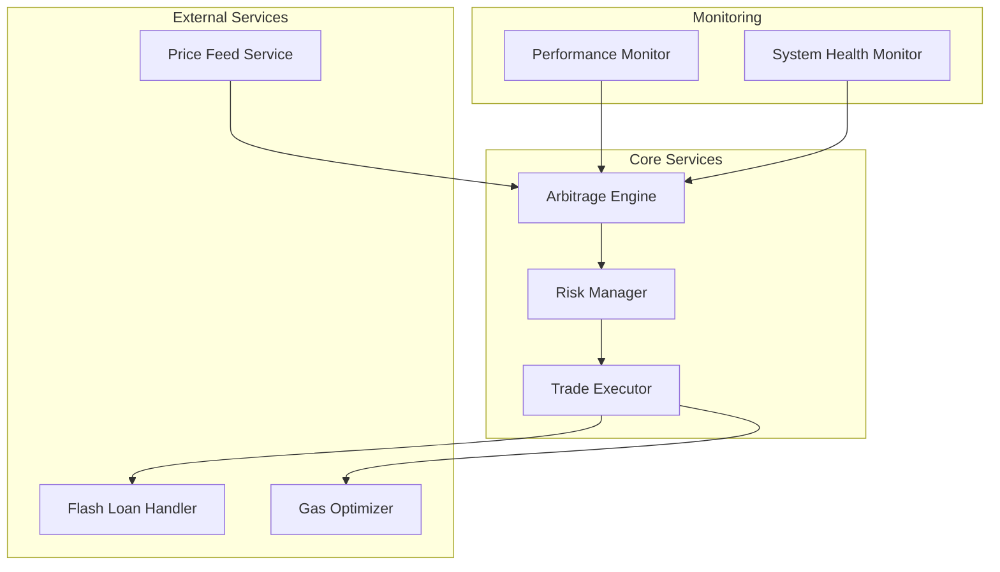
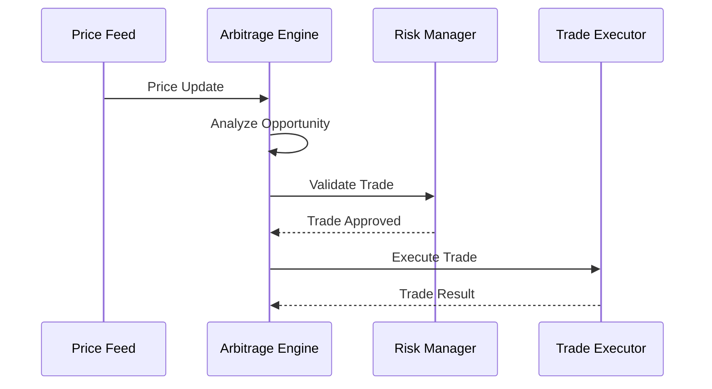

# System Architecture

## High-Level Overview

## Component Interactions

### Price Feed Service
- Connects to multiple exchanges via WebSocket
- Normalizes price data
- Implements heartbeat monitoring
- Handles connection recovery

### Arbitrage Engine
- Analyzes price disparities
- Calculates potential profits
- Manages trade execution flow
- Implements circuit breakers

### Risk Manager
- Validates trade parameters
- Enforces position limits
- Monitors portfolio exposure
- Implements stop-loss mechanisms

**Note:** The current system does not explicitly implement MEV (Miner Extractable Value) protection strategies. Potential strategies to mitigate MEV risks include using transaction privacy solutions, implementing transaction ordering, or using a Flashbots-like relay.

### Trade Executor
- Manages order execution
- Handles transaction signing
- Implements retry mechanisms
- Monitors transaction status

### Monitoring and Analytics Dashboard
The system includes a monitoring and analytics dashboard to visualize system performance and trading activity. Key components include:

- **Arbitrage Visualizer:**  Visualizes real-time price data and arbitrage opportunities.
- **Arbitrage Opportunities:** Displays a list of detected arbitrage opportunities with relevant details.
- **Trade History:** Shows a history of executed trades, including profit/loss and other metrics.

### Flash Loan Handler
- Integrates with Aave or other flash loan providers
- Manages flash loan requests and repayments
- Handles flash loan specific parameters and callbacks

### Gas Optimizer
- Estimates optimal gas prices for transactions
- Dynamically adjusts gas prices based on network conditions
- Implements gas limit management

### Configuration Management
The system utilizes a configuration management module (`utils/config/`) to handle various settings and parameters. 
Detailed configuration instructions can be found in [Configuration Documentation](./configuration.md). 
This module likely manages:

- API keys and endpoints for exchanges and services
- Network settings (e.g., Ethereum RPC URL, Chain ID)
- Trading parameters (e.g., slippage tolerance, gas price limits, profit thresholds)
- Risk management parameters (e.g., position limits, stop-loss percentages)

### Smart Contracts
The core trading logic, particularly for DEX arbitrage and flash loan interactions, is implemented in Solidity smart contracts (e.g., `contracts/ArbTrader.sol`). 
These contracts are crucial for:

- **DEX Trading:** Executing trades on decentralized exchanges like Uniswap and Sushiswap. The `Trade Executor` component interacts with these contracts to perform swaps.
- **Flash Loan Management:** Requesting and repaying flash loans from protocols like Aave. The `Flash Loan Handler` utilizes smart contracts for initiating flash loans and managing repayments.
- **On-chain Logic:** Enforcing certain on-chain constraints and logic that are critical for the arbitrage strategy.
# System Architecture

## High-Level Overview

## Component Interactions

### Price Feed Service
- Connects to multiple exchanges via WebSocket
- Normalizes price data
- Implements heartbeat monitoring
- Handles connection recovery

### Arbitrage Engine
- Analyzes price disparities
- Calculates potential profits
- Manages trade execution flow
- Implements circuit breakers

### Risk Manager
- Validates trade parameters
- Enforces position limits
- Monitors portfolio exposure
- Implements stop-loss mechanisms

**Note:** The current system does not explicitly implement MEV (Miner Extractable Value) protection strategies. This could be a potential area for future improvement to mitigate frontrunning and other MEV-related risks.

### Trade Executor
- Manages order execution
- Handles transaction signing
- Implements retry mechanisms
- Monitors transaction status

### Monitoring and Analytics Dashboard
The system includes a monitoring and analytics dashboard to visualize system performance and trading activity. Key components include:

- **Arbitrage Visualizer:**  Visualizes real-time price data and arbitrage opportunities.
- **Arbitrage Opportunities:** Displays a list of detected arbitrage opportunities with relevant details.
- **Trade History:** Shows a history of executed trades, including profit/loss and other metrics.

### Flash Loan Handler
- Integrates with Aave or other flash loan providers
- Manages flash loan requests and repayments
- Handles flash loan specific parameters and callbacks

### Gas Optimizer
- Estimates optimal gas prices for transactions
- Dynamically adjusts gas prices based on network conditions
- Implements gas limit management

### Configuration Management
The system utilizes a configuration management module (`utils/config/`) to handle various settings and parameters. 
Detailed configuration instructions can be found in [Configuration Documentation](./configuration.md). 
This module likely manages:

- API keys and endpoints for exchanges and services
- Network settings (e.g., Ethereum RPC URL, Chain ID)
- Trading parameters (e.g., slippage tolerance, gas price limits, profit thresholds)
- Risk management parameters (e.g., position limits, stop-loss percentages)

## Data Flow

